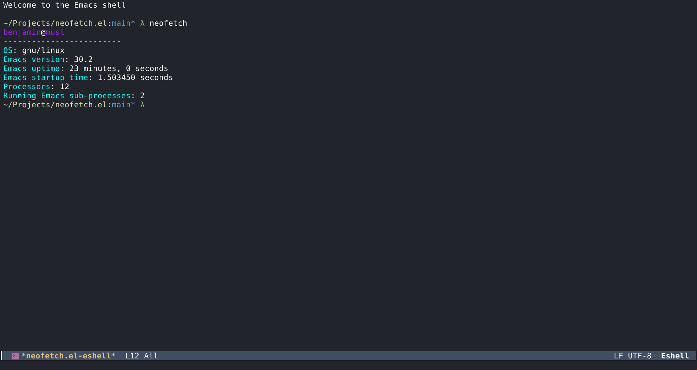

# neofetch.el

Neofetch program written in pure Emacs Lisp. Does not require any external programs and runs on any operating system.

## Installing

Just copy neofetch.el to a directory in your `load-path`. Make sure to require 'neofetch in your configuration file so you can run it.

## Usage

While it is recommended you run it inside Eshell, it can also be ran from M-x.

## Notes

If you want to include this in some fancy screenshot for the Internet, you should press C-g to get rid of the ugly duplicate output in the minibuffer.

## Screenshot

